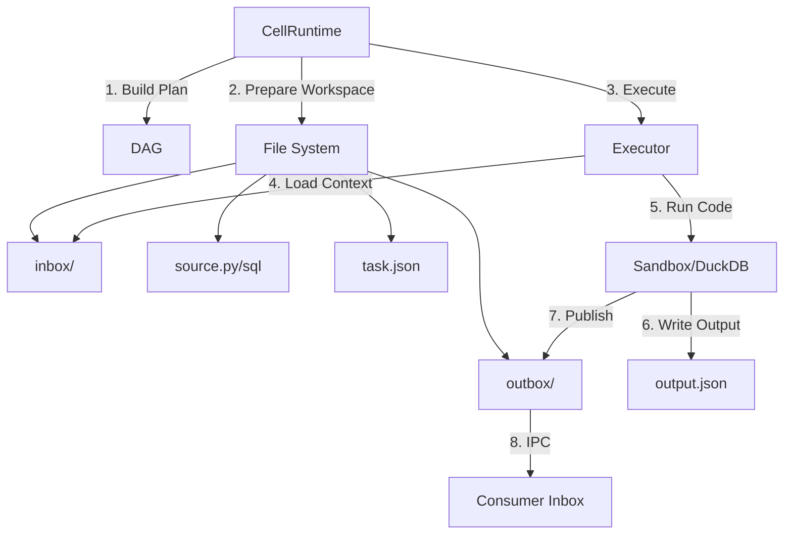
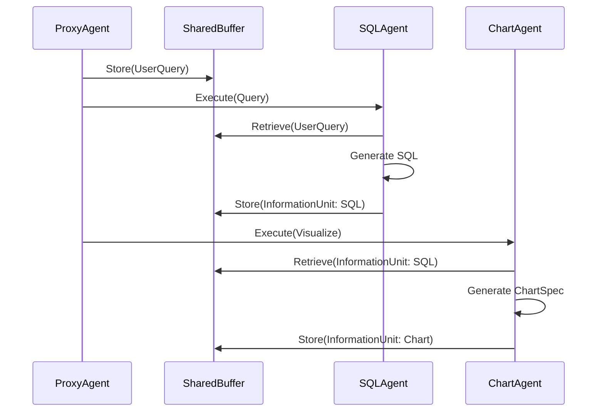

# DataLab - Software Design Document (SDD)

**Version**: 2.0  
**Date**: 2026-03-09  
**Based on**: arXiv:2412.02205v3 - "DataLab: A Unified Platform for LLM-Powered Business Intelligence"  
**Note**: This version reflects the actual implemented state of the codebase. Planned but unimplemented features are explicitly marked. See `TODO.md` for the full gap analysis.

---

## Table of Contents

1. [Introduction](#1-introduction)
2. [System Overview](#2-system-overview)
3. [Architecture Design](#3-architecture-design)
4. [Data Models](#4-data-models)
5. [Module Design](#5-module-design)
6. [API Specification](#6-api-specification)
7. [Frontend Design](#7-frontend-design)
8. [Security & Sandboxing](#8-security--sandboxing)
9. [Internationalization](#9-internationalization)
10. [Deployment](#10-deployment)

---

## 1. Introduction

### 1.1 Purpose

DataLab is a unified Business Intelligence (BI) platform that integrates an LLM-based multi-agent framework with an augmented computational notebook interface. It supports the full BI workflow — data preparation, analysis, and visualization — for different data roles (engineers, scientists, analysts) in a single environment.

### 1.2 Scope

This document covers the complete software design for:

- **Backend**: FastAPI server with agent framework, knowledge modules, communication protocols, and execution engines
- **Frontend**: React/TypeScript notebook interface with multi-language cell support, chart builder, and LLM chat panel
- **Infrastructure**: Database schema, vector store, containerization

### 1.3 Key Design Goals

| Goal | Description |
|------|-------------|
| **Unification** | Single platform for SQL, Python, visualization, and markdown |
| **Intelligence** | LLM agents automate BI tasks via natural language |
| **Extensibility** | DAG-based agent workflows, plugin APIs for data connectors |
| **Efficiency** | Cell-based context management reduces token costs by ~60% |
| **Collaboration** | Multi-role notebook with real-time updates |
| **Governance** | Workspace isolation, RBAC, audit logging (planned, not yet implemented) |

### 1.4 Technology Stack

| Layer | Technology | Rationale |
|-------|-----------|-----------|
| Backend Runtime | Python 3.11+ / FastAPI | Async, AI/ML ecosystem, type safety |
| Frontend | React 18 + TypeScript + Vite | Complex UI, strong typing, fast builds |
| Database | SQLite (dev) / PostgreSQL (prod) | SQLAlchemy ORM, Alembic migrations |
| Vector Store | ChromaDB | Embedded, Python-native (dependency listed; not yet integrated) |
| LLM Gateway | LiteLLM | Unified API: OpenAI, Anthropic, Ollama, Azure |
| SQL Engine | DuckDB | In-process OLAP, zero config, Pandas interop |
| Python Execution | Subprocess sandbox | Code execution with timeout (resource limits not enforced) |
| Charts | ECharts | Rich interactive visualization |
| Code Editor | Monaco Editor | VS Code engine, syntax highlighting, autocomplete |
| Styling | Tailwind CSS | Utility-first styling |
| Real-time | WebSocket (FastAPI) | Streaming execution results, agent progress |
| i18n | react-i18next | Bilingual EN/ZH support |

---

## 2. System Overview

### 2.1 High-Level Architecture

```
┌─────────────────────────────────────────────────────────┐
│                    Frontend (React/TS)                    │
│  ┌──────────┐ ┌──────────┐ ┌──────────┐ ┌────────────┐ │
│  │ Notebook  │ │ Chat     │ │ Chart    │ │ Data       │ │
│  │ Interface │ │ Panel    │ │ Builder  │ │ Explorer   │ │
│  └─────┬─────┘ └─────┬────┘ └────┬─────┘ └─────┬──────┘ │
│        └──────────────┴──────────┴──────────────┘        │
│                         │ REST + WebSocket                │
└─────────────────────────┼────────────────────────────────┘
                          │
┌─────────────────────────┼────────────────────────────────┐
│                    Backend (FastAPI)                       │
│  ┌──────────────────────┴───────────────────────────┐    │
│  │                   API Layer                       │    │
│  │  /api/notebooks  /api/cells  /api/agents  /ws     │    │
│  └──────────────────────┬───────────────────────────┘    │
│                         │                                 │
│  ┌──────────────────────┴───────────────────────────┐    │
│  │              Agent Framework                      │    │
│  │  ┌───────┐ ┌─────┐ ┌────────┐ ┌───────┐         │    │
│  │  │ Proxy │→│ SQL │ │ Python │ │ Chart │ ...      │    │
│  │  │ Agent │ │Agent│ │ Agent  │ │ Agent │         │    │
│  │  └───┬───┘ └──┬──┘ └───┬────┘ └───┬───┘         │    │
│  │      │        │        │          │              │    │
│  │  ┌───┴────────┴────────┴──────────┴───┐          │    │
│  │  │      Inter-Agent Communication      │          │    │
│  │  │  SharedBuffer │ FSM │ InfoUnits     │          │    │
│  │  └────────────────────────────────────┘          │    │
│  └──────────────────────────────────────────────────┘    │
│                         │                                 │
│  ┌──────────┐ ┌─────────┴──────┐ ┌──────────────────┐   │
│  │ Domain   │ │ Cell Context   │ │ Execution        │   │
│  │Knowledge │ │ Management     │ │ Engines          │   │
│  │ Module   │ │ (DAG)          │ │ Python │ SQL     │   │
│  └────┬─────┘ └────────────────┘ └──────────────────┘   │
│       │                                                   │
│  ┌────┴─────┐ ┌──────────────┐                           │
│  │ ChromaDB │ │ SQLite/PG    │                           │
│  │ (vectors)│ │ (metadata)   │                           │
│  └──────────┘ └──────────────┘                           │
└──────────────────────────────────────────────────────────┘
                          │
              ┌───────────┴───────────┐
              │    LLM Providers      │
              │ OpenAI│Anthropic│Ollama│
              └───────────────────────┘
```

### 2.2 Component Summary

| Component | Responsibility | Status |
|-----------|---------------|--------|
| **ChatBI Agent** | Handles NL→SQL and NL→Chart generation in a unified flow | Implemented |
| **Python Agent** | Generates Python data science code from natural language | Implemented |
| **Domain Knowledge** | Knowledge generation (Map-Reduce), graph storage, retrieval | Implemented (ChromaDB embeddings not wired) |
| **Inter-Agent Comm** | Structured info units, shared buffer, FSM state machine | Implemented (FSM not used in practice) |
| **Context Management** | DAG planning, variable tracking, per-cell workspace manifests | Implemented |
| **Execution Engines** | Sandboxed Python execution, DuckDB SQL engine | Implemented |
| **Cell Runtime** | Stateless DAG cell agents with file-backed IPC | Implemented |
| **Notebook UI** | Multi-language cells, Monaco editor, chart rendering | Implemented |
| **Proxy Agent** | FSM-based orchestration of specialized agents | Not implemented |
| **Enterprise Control Plane** | Workspace, RBAC, audit, scoped WebSocket | Not implemented |

### 2.3 Paper Alignment

The paper `2412.02205v3.pdf` defines three core research modules:

- **Domain Knowledge Incorporation** for enterprise-specific BI semantics and jargon
- **Inter-Agent Communication** via structured information units and FSM-driven collaboration
- **Cell-based Context Management** for notebook-aware context pruning and token efficiency

All three modules are coded but the FSM-based multi-agent orchestration (ProxyAgent routing to specialized agents) is not yet active. The `ChatBIAgent` currently handles SQL and chart generation as a single unified agent rather than orchestrating through the FSM. Enterprise governance features (workspace isolation, RBAC, audit) described in the paper extension are not yet implemented.

---

## 3. Architecture Design

### 3.1 Backend Package Structure

```
backend/app/
├── main.py              # FastAPI application factory
├── config.py            # Pydantic Settings (env-based config)
├── database.py          # SQLAlchemy engine, session factory
├── notebook_runtime.py  # Notebook runtime bundle, context builders
├── api/                 # Route handlers
│   ├── __init__.py
│   ├── notebooks.py     # CRUD for notebooks
│   ├── cells.py         # CRUD for cells + execution + AI edit
│   ├── agents.py        # Agent query endpoint
│   ├── folders.py       # Folder CRUD
│   ├── knowledge.py     # Knowledge CRUD + retrieval
│   ├── datasources.py   # Data source connections + CSV upload
│   └── websocket.py     # WebSocket handler
├── models/              # SQLAlchemy ORM
│   ├── __init__.py
│   ├── notebook.py
│   ├── cell.py
│   ├── datasource.py
│   ├── folder.py
│   ├── knowledge.py
│   └── user.py          # Exists but not used by any endpoint
├── schemas/             # Pydantic schemas
│   ├── __init__.py
│   ├── notebook.py
│   ├── cell.py
│   ├── agent.py
│   ├── folder.py
│   └── knowledge.py
├── agents/              # Agent implementations
│   ├── __init__.py
│   ├── base.py          # BaseAgent ABC
│   ├── chatbi_agent.py  # ChatBIAgent (unified SQL+Chart)
│   ├── context_builder.py # Notebook context builder for agents
│   └── python_agent.py  # PythonAgent (NL2DSCode)
├── communication/       # Inter-Agent Communication
│   ├── __init__.py
│   ├── info_unit.py     # InformationUnit dataclass
│   ├── shared_buffer.py # SharedInformationBuffer
│   ├── fsm.py           # FiniteStateMachine (coded, not actively used)
│   └── protocol.py      # CommunicationProtocol
├── knowledge/           # Domain Knowledge
│   ├── __init__.py
│   ├── generator.py     # MapReduceKnowledgeGenerator
│   ├── graph.py         # KnowledgeGraph
│   ├── retriever.py     # KnowledgeRetriever
│   ├── profiler.py      # DataProfiler
│   └── dsl.py           # DSLTranslator
├── context/             # Cell Context Management
│   ├── __init__.py
│   ├── dag.py           # CellDependencyDAG
│   ├── retrieval.py     # ContextRetriever
│   └── tracker.py       # VariableTracker
├── execution/           # Code Execution
│   ├── __init__.py
│   ├── cell_runtime.py  # CellRuntime (stateless DAG + file IPC)
│   ├── python_executor.py
│   ├── sql_executor.py
│   └── sandbox.py       # Simple delegation sandbox
├── llm/                 # LLM Abstraction
│   ├── __init__.py
│   ├── client.py        # LiteLLM wrapper
│   ├── tools.py         # Function call definitions (not actively used)
│   └── prompts/         # Jinja2 prompt templates
│       ├── system.j2
│       ├── sql_generation.j2
│       ├── python_generation.j2
│       ├── chart_generation.j2
│       ├── insight_generation.j2
│       ├── knowledge_extraction.j2
│       ├── query_rewrite.j2
│       ├── dsl_translation.j2
│       ├── chat_generation.j2
│       └── task_routing.j2
└── utils/
    └── helpers.py
```

### 3.2 Frontend Package Structure

```
frontend/src/
├── App.tsx              # Root component
├── main.tsx             # Entry point
├── index.css            # Tailwind imports + custom styles
├── i18n/                # Internationalization
│   ├── index.ts         # i18next config
│   ├── en.json          # English translations
│   └── zh.json          # Chinese translations
├── components/
│   ├── notebook/        # Core notebook components
│   │   ├── Notebook.tsx         # Main notebook container
│   │   ├── CellContainer.tsx    # Generic cell wrapper
│   │   ├── SqlCell.tsx          # SQL cell with Monaco + results table
│   │   ├── PythonCell.tsx       # Python cell with Monaco + output
│   │   ├── ChartCell.tsx        # Chart cell with JSON spec + ECharts preview
│   │   ├── MarkdownCell.tsx     # Markdown cell with edit/preview toggle
│   │   ├── CellToolbar.tsx      # Cell action buttons + AI edit input
│   │   ├── AddCellButton.tsx    # Add new cell button
│   │   ├── CellRuntimeCard.tsx  # Cell agent runtime details panel
│   │   └── CellGenerationPanel.tsx # Right-side AI progress + draft
│   ├── editor/
│   │   └── MonacoEditor.tsx     # Monaco wrapper with drag-to-resize
│   ├── chart/
│   │   └── ChartRenderer.tsx    # ECharts renderer
│   ├── sidebar/
│   │   └── Sidebar.tsx          # Notebooks + data sources + folders
│   ├── chat/
│   │   └── ChatPanel.tsx        # LLM chat with sections, tables, charts
│   ├── common/
│   │   ├── Header.tsx           # App header with language/theme toggle
│   │   ├── DataTable.tsx        # Tabular data display
│   │   ├── LoadingSpinner.tsx
│   │   └── ErrorBoundary.tsx
│   └── layout/
│       └── MainLayout.tsx       # App layout with sidebar
├── stores/              # Zustand state management
│   ├── notebookStore.ts # Notebook, cell, folder, AI edit state
│   ├── chatStore.ts     # Chat history state (WebSocket-driven)
│   └── uiStore.ts       # UI preferences (persisted to localStorage)
├── services/
│   ├── api.ts           # Axios HTTP client + SSE streaming
│   └── websocket.ts     # WebSocket client with auto-reconnect
└── types/
    └── index.ts         # TypeScript type definitions
```

---

## 4. Data Models

### 4.1 Database Schema (SQLAlchemy)

#### Notebook

| Column | Type | Description |
|--------|------|-------------|
| id | UUID (PK) | Unique notebook identifier |
| title | String(256) | Notebook title |
| description | Text | Optional description |
| folder_id | UUID (FK, nullable) | Parent folder |
| created_at | DateTime | Creation timestamp |
| updated_at | DateTime | Last modification timestamp |

#### Folder

| Column | Type | Description |
|--------|------|-------------|
| id | UUID (PK) | Unique folder identifier |
| name | String(256) | Folder name |
| position | Integer | Display order |
| created_at | DateTime | Creation timestamp |

#### Cell

| Column | Type | Description |
|--------|------|-------------|
| id | UUID (PK) | Unique cell identifier |
| notebook_id | UUID (FK) | Parent notebook (cascade delete) |
| cell_type | Enum | `sql`, `python`, `chart`, `markdown` |
| source | Text | Cell source code/content |
| output | JSON | Execution output (stdout, data, errors, agent runtime info) |
| position | Integer | Order within notebook |
| metadata_ | JSON | Cell-specific metadata |
| created_at | DateTime | Creation timestamp |
| updated_at | DateTime | Last modification timestamp |

#### DataSource

| Column | Type | Description |
|--------|------|-------------|
| id | UUID (PK) | Unique datasource identifier |
| name | String(128) | Display name |
| ds_type | Enum | `sqlite`, `postgresql`, `mysql`, `csv`, `duckdb` |
| connection_string | Text | Connection string or file path (plaintext) |
| metadata_ | JSON | Schema cache, row count, file path |
| created_at | DateTime | Creation timestamp |

#### KnowledgeNode

| Column | Type | Description |
|--------|------|-------------|
| id | UUID (PK) | Unique node identifier |
| node_type | Enum | `database`, `table`, `column`, `value`, `jargon`, `alias` |
| name | String(256) | Node name |
| parent_id | UUID (FK, nullable) | Parent node in the tree |
| components | JSON | Knowledge components (description, usage, tags, etc.) |
| embedding_id | String(256) | ChromaDB embedding reference (not yet used) |
| datasource_id | UUID (FK, nullable) | Associated data source |
| created_at | DateTime | Creation timestamp |
| updated_at | DateTime | Last modification timestamp |

#### User

| Column | Type | Description |
|--------|------|-------------|
| id | UUID (PK) | Unique user identifier |
| email | String(320) | Unique email |
| display_name | String(256) | Display name |
| auth_provider | String(64) | Auth method (default: "trusted-header") |
| created_at | DateTime | Creation timestamp |
| updated_at | DateTime | Last modification timestamp |

**Note**: The User model exists in the schema but is not used by any API endpoint. There is no authentication or authorization enforcement.

### 4.2 In-Memory Models

#### InformationUnit (Inter-Agent Communication)

```python
@dataclass
class InformationUnit:
    id: str                  # UUID
    data_source: str         # Table/dataset identifier
    role: str                # Agent role (e.g., "SQL Agent")
    action: str              # Action performed (e.g., "generate_sql_query")
    description: str         # Summary of the action
    content: Any             # Output (SQL query, Python code, chart spec, etc.)
    timestamp: float         # Unix timestamp
    cell_id: Optional[str]   # Associated notebook cell
```

#### FSMState (Agent State Machine)

```python
@dataclass
class FSMState:
    agent_id: str
    state: Literal["wait", "execution", "finish"]
    transitions: List[str]   # Target agent IDs on edges
```

#### CellDependencyNode (DAG)

```python
@dataclass
class CellDependencyNode:
    cell_id: str
    cell_type: str
    variables_defined: Set[str]   # New variables created
    variables_referenced: Set[str] # External variables used
    ancestors: Set[str]            # Parent cell IDs
    descendants: Set[str]          # Child cell IDs
```

### 4.3 DSL Specification

The Domain-Specific Language for query translation:

```json
{
  "query": "show me the income of TencentBI this year",
  "rewritten_query": "Show the total income of TencentBI product for the year 2026",
  "dsl": {
    "MeasureList": [
      {"column": "shouldincome_after", "aggregation": "SUM", "alias": "total_income"}
    ],
    "DimensionList": [
      {"column": "prod_class4_name"}
    ],
    "ConditionList": [
      {"column": "prod_class4_name", "operator": "=", "value": "TencentBI"},
      {"column": "ftime", "operator": ">=", "value": "2026-01-01"}
    ],
    "OrderBy": [],
    "Limit": null,
    "ChartType": "bar"
  }
}
```

---

## 5. Module Design

### 5.1 Agent Framework

#### 5.1.1 BaseAgent

All agents inherit from `BaseAgent`, which provides:

- LLM client access
- Prompt template rendering
- Structured output parsing
- Error handling with retry logic
- Information unit creation

```
BaseAgent (ABC)
├── execute(query, context) → InformationUnit
├── _build_prompt(template, **kwargs) → str
├── _call_llm(messages) → str
├── _parse_output(raw) → Any
└── _create_info_unit(content) → InformationUnit
```

#### 5.1.2 ChatBIAgent (Active Agent)

The primary active agent that:
1. Receives user queries
2. Generates SQL via LLM streaming
3. Executes SQL on DuckDB
4. Optionally generates chart specifications
5. Streams structured progress sections to the frontend

Supports both streaming (`execute_stream`) and synchronous (`execute`) execution.

#### 5.1.3 PythonAgent

Converts natural language to Python data science code using the `python_generation.j2` template.

| Agent | Task | Input | Output | Status |
|-------|------|-------|--------|--------|
| ChatBIAgent | NL2SQL+Chart | NL query + schema + knowledge | SQL + results + chart | Active |
| PythonAgent | NL2DSCode | NL query + context + data | Python code string | Active |
| ProxyAgent | FSM orchestration | NL query | Coordinated multi-agent output | Not implemented |
| InsightAgent | NL2Insight | NL query + data | Insight text | Not implemented |
| EDAAgent | Exploratory analysis | Dataset reference | Statistical summary | Not implemented |
| CleaningAgent | Data cleaning | Dataset + issues | Cleaning code | Not implemented |
| ReportAgent | Report generation | Analysis results | Markdown report | Not implemented |

### 5.2 Domain Knowledge Module

#### 5.2.1 Knowledge Generation (Map-Reduce)

**Map Phase**: For each historical script associated with a table:
1. Send script + schema + lineage to LLM
2. Extract knowledge components per DB/table/column
3. Self-calibration: LLM scores result (1-5), regenerate if < threshold

**Reduce Phase**: Aggregate all map results:
1. Synthesize into unified DB/table/column knowledge
2. Resolve conflicts, merge descriptions
3. Output final knowledge components

#### 5.2.2 Knowledge Graph

Tree-based structure stored in SQLite with ChromaDB embeddings:

```
Database Node
├── Table Node
│   ├── Column Node
│   │   └── Value Node
│   └── Column Node
│       └── Alias Node
└── Alias Node
```

Each node contains: `name`, `description`, `usage`, `tags`, and type-specific fields.

#### 5.2.3 Knowledge Retrieval (Coarse-to-Fine)

1. **Coarse-Grained**: Lexical search (SQL ILIKE) + datasource-scoped name matching
2. **Fine-Grained Ordering**: Weighted score = ω₁·lex_score + ω₂·sem_score + ω₃·llm_score
3. **Top-K Selection**: Return highest-scored nodes

**Note**: The semantic score currently uses character-set overlap as a lightweight placeholder. ChromaDB vector embeddings are not yet integrated into the retrieval pipeline.

#### 5.2.4 DSL Translation

Query → JSON DSL with fields: MeasureList, DimensionList, ConditionList, OrderBy, Limit, ChartType. Validated via JSON Schema.

### 5.3 Inter-Agent Communication

#### 5.3.1 Information Units

Structured 6-field format replacing unstructured NL:
- `data_source`: Dataset identifier
- `role`: Agent identity
- `action`: Behavior performed
- `description`: Action summary
- `content`: Agent output
- `timestamp`: Completion time

#### 5.3.2 Shared Information Buffer

- In-memory dict-based store keyed by agent role + timestamp
- Dynamic capacity expansion (doubles when full)
- TTL-based cleanup for outdated entries
- Has an `asyncio.Lock` defined but synchronous methods do not acquire it

#### 5.3.3 FSM-based Execution Plan

Generated by ProxyAgent based on query analysis:
- Nodes = agents, Edges = information flow directions
- States: Wait → Execution → Finish
- Selective retrieval: each agent only receives relevant info from predecessors in the FSM

#### 5.3.4 Communication Protocol

Combines SharedBuffer and FSM into a `CommunicationProtocol` class that supports:
- Plan setup from execution plan
- Context preparation (selective retrieval from predecessors)
- Result storage and agent lifecycle management

**Note**: The CommunicationProtocol is coded but not actively used since the ProxyAgent doesn't exist yet.

### 5.4 Cell-based Context Management

#### 5.4.1 DAG Construction

1. **Identify variables**: Python cells → AST for globals; SQL cells → output DataFrame name
2. **Find references**: For each cell, identify external variables defined in other cells
3. **Build DAG**: Directed edges from defining cell to referencing cell

#### 5.4.2 Context Retrieval

- **Cell-level query**: Traverse ancestors in DAG
- **Notebook-level query**: Find data variable, locate defining cell, include descendants
- **Pruning**: Filter by task type (e.g., NL2DSCode → only Python cells)
- **Buffer retrieval**: Fetch associated info units for agent-generated cells

#### 5.4.3 Notebook Runtime Bundle

- A notebook runtime bundle is built from ordered cells and includes the dependency DAG, typed cell metadata, and adaptive retrieval helpers
- The dependency DAG only links a cell to the latest previous definition of a referenced variable, which preserves notebook execution order and avoids illegal forward references
- SQL cells can publish named notebook outputs with `-- output: variable_name`
- Python execution replays ancestor Python cell sources from cell-agent workspace files and injects upstream tabular outputs as DataFrames before running the active cell
- SQL execution runs in an isolated DuckDB connection seeded from workspace data sources and upstream notebook tables loaded from file-backed IPC payloads
- Chart cells validate `data_source` references against upstream notebook outputs before execution
- Markdown cells resolve placeholders such as `{{ sales_summary.row_count }}`, `{{ product_metrics.columns }}`, and `{{ product_metrics.preview }}`
- AI-edit requests reuse the same runtime bundle to build cell-specific context and preserve linkage contracts such as SQL output aliases, chart `data_source` references, and markdown placeholders

#### 5.4.4 Cell Runtime (Stateless DAG + File IPC)

- Every notebook cell is treated as a cell agent with its own workspace directory under `data/cell_runtime/<notebook>/<position>-<type>-<id>/`
- Each execution request rebuilds a fresh DAG plan and executes only the target cell plus its ancestors in notebook order
- Every workspace contains `agent.json`, `source.*`, `task.json`, `task.md`, `context.json`, `bootstrap.py`, `output.json`, and `inbox/` + `outbox/` folders
- Direct dependency messages are written as JSON files and copied from the producer cell's `outbox/` into the consumer cell's `inbox/`
- The frontend surfaces runtime state through the `Cell Agent Runtime` details panel on executed cells

### 5.5 Core Implementations

#### 5.5.1 Cell Agent Architecture

Each cell in the notebook is treated as an autonomous agent. This architecture ensures that every execution is reproducible and that dependencies are explicitly managed.



**Key Files in Cell Workspace:**
- `task.json`: Metadata about the current execution (run_id, cell_id, plan).
- `context.json`: Compiled context including ancestor summaries and table/value catalogs.
- `inbox/`: Contains JSON messages from direct upstream dependencies.
- `outbox/`: Contains JSON messages for direct downstream dependencies.

#### 5.5.2 Inter-Agent Information Sharing

DataLab uses two distinct communication layers:

1.  **Multi-Agent Communication (Global):** Uses a `SharedBuffer` and `InformationUnit` for orchestration between specialized agents (SQL, Python, etc.).
2.  **Cell-to-Cell IPC (Local):** Uses file-backed `inbox/outbox` handoffs for notebook execution.



**InformationUnit Structure (6 Fields):**
- `data_source`: The dataset being operated on.
- `role`: The identity of the producing agent.
- `action`: The specific operation performed.
- `description`: A human-readable summary.
- `content`: The actual payload (SQL, Code, Spec).
- `timestamp`: Ordering and TTL reference.

#### 5.5.3 Context Management (Algorithm 3)

The system manages context using a Directed Acyclic Graph (DAG) based on variable tracking.

1.  **Variable Identification:** Python cells use AST analysis; SQL cells identify the output table name.
2.  **Dependency Mapping:** A cell depends on the *latest* previous cell that defines its referenced variables.
3.  **Context Pruning:** When executing a cell, only its ancestors in the DAG are included in the runtime context, significantly reducing token consumption.

```mermaid
graph LR
    C1[Cell 1: df = load_csv] -->|defines 'df'| C2[Cell 2: df_clean = clean(df)]
    C2 -->|defines 'df_clean'| C3[Cell 3: plot(df_clean)]
    C1 -->|defines 'df'| C4[Cell 4: summary(df)]
    style C3 fill:#f9f,stroke:#333,stroke-width:4px
```

**Execution Plan for Cell 3:** [Cell 1, Cell 2, Cell 3] (Cell 4 is excluded).

---

## 6. API Specification

### 6.1 REST Endpoints

Request ID middleware generates a UUID for each request (or uses `X-Request-ID` if provided).

#### Notebooks

| Method | Path | Description |
|--------|------|-------------|
| GET | `/api/notebooks` | List all notebooks |
| POST | `/api/notebooks` | Create notebook |
| GET | `/api/notebooks/{id}` | Get notebook with cells |
| PUT | `/api/notebooks/{id}` | Update notebook metadata |
| DELETE | `/api/notebooks/{id}` | Delete notebook |

#### Folders

| Method | Path | Description |
|--------|------|-------------|
| GET | `/api/folders` | List all folders |
| POST | `/api/folders` | Create folder |
| PUT | `/api/folders/{id}` | Update folder name/position |
| DELETE | `/api/folders/{id}` | Delete folder (unlinks notebooks) |

#### Cells

| Method | Path | Description |
|--------|------|-------------|
| POST | `/api/notebooks/{id}/cells` | Add cell to notebook |
| PUT | `/api/cells/{id}` | Update cell content |
| DELETE | `/api/cells/{id}` | Delete cell |
| POST | `/api/cells/{id}/execute` | Execute cell via DAG runtime |
| POST | `/api/cells/{id}/edit-with-ai` | Stream an AI rewrite (SSE) |
| PUT | `/api/cells/{id}/move` | Reorder cell |

#### Agents

| Method | Path | Description |
|--------|------|-------------|
| POST | `/api/agents/query` | Submit NL query to ChatBI agent |

#### Knowledge

| Method | Path | Description |
|--------|------|-------------|
| POST | `/api/knowledge/generate` | Trigger knowledge generation for a datasource |
| GET | `/api/knowledge/search` | Search knowledge graph |
| GET | `/api/knowledge/graph/{datasource_id}` | Get knowledge graph tree |
| POST | `/api/knowledge/nodes` | Create a knowledge node |

#### Data Sources

| Method | Path | Description |
|--------|------|-------------|
| GET | `/api/datasources` | List data sources |
| POST | `/api/datasources` | Add data source |
| POST | `/api/datasources/upload-csv` | Upload CSV file as data source |
| GET | `/api/datasources/{id}/schema` | Get schema (tables/columns) |
| POST | `/api/datasources/{id}/query` | Execute raw SQL |

#### Health

| Method | Path | Description |
|--------|------|-------------|
| GET | `/api/health` | Health check |

### 6.2 WebSocket Protocol

Endpoint: `ws://host/ws/{notebook_id}`

Messages follow the format:

```json
{
  "type": "cell_execute | agent_query | agent_progress | cell_update | error",
  "payload": { ... },
  "timestamp": 1709470800
}
```

**Client → Server**:
- `cell_execute`: `{ "cell_id": "...", "source": "...", "cell_type": "..." }`
- `agent_query`: `{ "query": "...", "datasource_id": "..." }`
- `ping`: heartbeat

**Server → Client**:
- `agent_progress`: `{ "task_id": "...", "status": "...", "message": "...", "data": ..., "chart": ..., "sections": [...] }`
- `agent_complete`: `{ "task_id": "...", "status": "completed", "cells_created": [...] }`
- `cell_update`: `{ "cell_id": "...", "status": "...", "output": {...} }`
- `pong`: heartbeat response

**Note**: WebSocket cell execution uses the simple `ExecutionSandbox` (no DAG, no context, no IPC), while REST cell execution uses the full `CellRuntime` with DAG planning. This is a known inconsistency.

### 6.3 AI Edit Streaming (SSE)

Endpoint: `POST /api/cells/{id}/edit-with-ai`

Response type: `text/event-stream`

Event sequence:

- `progress`: context, DAG, IPC, rewrite, generation, and validation progress updates
- `chunk`: incremental model tokens for the right-side draft panel
- `done`: sanitized final cell source plus cell-agent workspace details
- `error`: structured failure state for the cell progress panel

---

## 7. Frontend Design

### 7.1 State Management (Zustand)

#### NotebookStore
- `notebooks: NotebookListItem[]`
- `folders: Folder[]`
- `activeNotebook: Notebook | null`
- `cells: Cell[]`
- `aiEditStateByCellId: Record<string, CellAIState>`
- Actions: `loadNotebook`, `addCell`, `updateCellSource`, `deleteCell`, `moveCell`, `executeCell`, `editCellWithAI`, `clearCellAIState`, `fetchFolders`, `createFolder`, `renameFolder`, `removeFolder`, `moveToFolder`

#### ChatStore
- `messages: ChatMessage[]`
- `isLoading: boolean`
- `activeDatasourceId: string | null`
- Actions: `sendQuery` (via WebSocket), `addMessage`, `updateMessage`, `clearHistory`, `setDatasource`

#### UIStore (persisted to localStorage)
- `language: 'en' | 'zh'`
- `darkMode: boolean`
- `sidebarOpen: boolean`
- `chatOpen: boolean`
- Actions: `toggleLanguage`, `toggleDarkMode`, `toggleSidebar`, `toggleChat`

### 7.2 Component Hierarchy

```
App
└── ErrorBoundary
    └── MainLayout
        ├── Header (logo, language toggle, theme toggle, sidebar toggle)
        ├── Sidebar
        │   ├── Notebooks tab (folders, drag-and-drop, rename, delete)
        │   └── Data Sources tab (list, CSV upload)
        ├── MainContent
        │   └── Notebook
        │       ├── CellContainer (for each cell)
        │       │   ├── CellToolbar (run, delete, move, AI edit input)
        │       │   ├── SqlCell / PythonCell / ChartCell / MarkdownCell
        │       │   ├── CellRuntimeCard (runtime details)
        │       │   └── CellGenerationPanel (right-side AI progress + draft)
        │       └── AddCellButton
        ├── ChatPanel (resizable side panel)
        │   ├── MessageSection (collapsible progress sections)
        │   ├── DataTable (inline results)
        │   ├── ChartRenderer (inline charts)
        │   └── ChatInput
        └── Floating Chat Toggle Button
```

### 7.3 Cell Types

| Cell Type | Editor | Output |
|-----------|--------|--------|
| SQL | Monaco (SQL mode) | DataTable component |
| Python | Monaco (Python mode, **currently readOnly**) | stdout + DataTable + stderr |
| Chart | Monaco (JSON mode) + live ECharts preview | ECharts renderer with notebook data binding |
| Markdown | Monaco (Markdown mode) with edit/preview toggle | Rendered markdown with resolved placeholders |

---

## 8. Security & Sandboxing

### 8.1 Python Execution Sandbox

- Subprocess-based execution with timeout (default 30s)
- Prefers the project virtualenv interpreter when available
- Temp file isolation per execution (cleaned up after)
- Output capture: stdout, stderr, DataFrames, exported values
- No OS-level resource limits (memory, CPU) enforced at process level
- No import restrictions enforced

### 8.2 SQL Execution

- DuckDB in-process for uploaded CSV/Parquet files
- `execute_isolated` creates a fresh connection per query for cell runtime execution
- Persistent connections per datasource for direct queries
- No query timeout enforcement beyond DuckDB defaults

### 8.3 API Security

- CORS configuration for frontend origin (configurable via `cors_origins`)
- Request ID middleware (generates UUID if not provided via `X-Request-ID`)
- No authentication or authorization enforcement
- No rate limiting
- No input sanitization beyond Pydantic validation

### 8.4 Known Security Gaps

- No authentication: any client can access any notebook, cell, or data source
- No authorization: no RBAC checks on any endpoint
- No audit logging: mutations are not recorded
- `/api/datasources/{id}/query` accepts arbitrary SQL without restrictions
- Python subprocess sandbox does not enforce memory or CPU limits
- Connection strings stored in plaintext

---

## 9. Internationalization

### 9.1 Frontend (react-i18next)

All user-facing strings stored in `en.json` and `zh.json`:

```json
{
  "notebook": {
    "title": "Notebook / 笔记本",
    "addCell": "Add Cell / 添加单元格",
    "execute": "Run / 运行"
  },
  "chat": {
    "placeholder": "Ask a question about your data... / 问一个关于数据的问题...",
    "send": "Send / 发送"
  }
}
```

### 9.2 Backend

- Error messages include both EN and ZH versions
- LLM prompts are in English (best LLM performance)
- API responses include a `locale` field for client-side rendering

---

## 10. Deployment

### 10.1 Development

```bash
# Backend
cd backend && pip install -e ".[dev]" && uvicorn app.main:app --reload

# Frontend
cd frontend && npm install && npm run dev
```

### 10.2 Docker Compose

```yaml
services:
  backend:
    build: ./backend
    ports: ["8000:8000"]
    volumes: ["./data:/app/data"]
    environment:
      - DATABASE_URL=sqlite:///./data/datalab.db
      - LITELLM_MODEL=gpt-4o

  frontend:
    build: ./frontend
    ports: ["3000:3000"]
    depends_on: [backend]
```

### 10.3 Environment Variables

| Variable | Default | Description |
|----------|---------|-------------|
| `DATABASE_URL` | `sqlite+aiosqlite:///./data/datalab.db` | Database connection |
| `LITELLM_MODEL` | `gpt-4o` | Default LLM model |
| `OPENAI_API_KEY` | (required) | OpenAI API key |
| `ANTHROPIC_API_KEY` | (optional) | Anthropic API key |
| `OLLAMA_BASE_URL` | `http://localhost:11434` | Ollama server URL |
| `CHROMA_PERSIST_DIR` | `./data/chroma` | ChromaDB storage path |
| `SANDBOX_TIMEOUT` | `30` | Python execution timeout (seconds) |
| `SANDBOX_MEMORY_MB` | `512` | Python execution memory limit (not enforced) |
| `CORS_ORIGINS` | `http://localhost:5171,...` | Allowed CORS origins |
