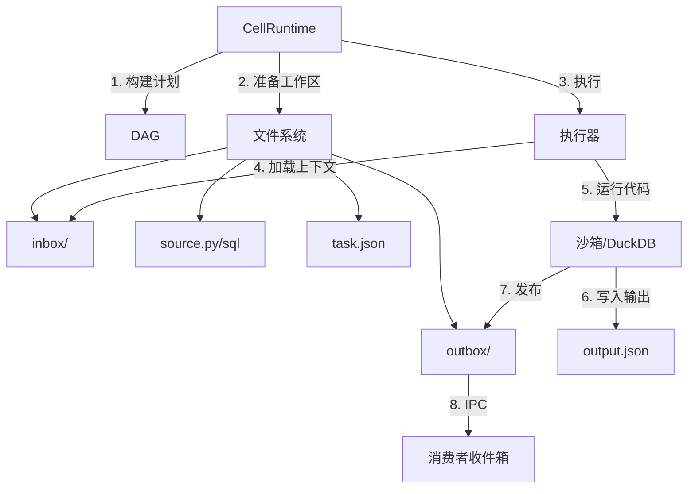
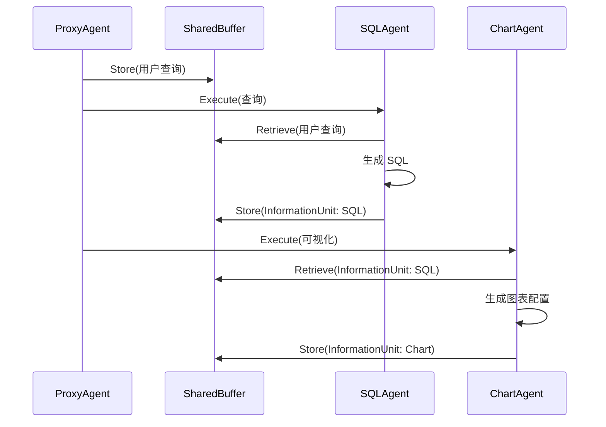

# DataLab - 软件设计文档 (SDD)

**版本**: 1.1  
**日期**: 2026-03-07  
**基于**: arXiv:2412.02205v3 - "DataLab: A Unified Platform for LLM-Powered Business Intelligence"

---

## 目录

1. [引言](#1-引言)
2. [系统概述](#2-系统概述)
3. [架构设计](#3-架构设计)
4. [数据模型](#4-数据模型)
5. [模块设计](#5-模块设计)
6. [API 规范](#6-api-规范)
7. [前端设计](#7-前端设计)
8. [安全与沙箱](#8-安全与沙箱)
9. [国际化](#9-国际化)
10. [部署](#10-部署)

---

## 1. 引言

### 1.1 目的

DataLab 是一个统一的商业智能 (BI) 平台，它将基于 LLM 的多智能体框架与增强的计算笔记本界面集成在一起。它支持完整的 BI 工作流 —— 数据准备、分析和可视化 —— 在一个环境中满足不同的数据角色（工程师、科学家、分析师）的需求。

### 1.2 范围

本文件涵盖以下内容的完整软件设计：

- **后端**: 具有智能体框架、知识模块、通信协议和执行引擎的 FastAPI 服务器
- **前端**: 支持多语言单元格、图表构建器和 LLM 聊天面板的 React/TypeScript 笔记本界面
- **基础设施**: 数据库架构、向量库、容器化

### 1.3 关键设计目标

| 目标 | 描述 |
|------|-------------|
| **统一性** | SQL、Python、可视化和 Markdown 的单一平台 |
| **智能性** | LLM 智能体通过自然语言自动化 BI 任务 |
| **可扩展性** | 基于 DAG 的智能体工作流，数据连接器的插件 API |
| **效率** | 基于单元格的上下文管理减少了约 60% 的 Token 成本 |
| **协作性** | 具有实时更新的多角色笔记本 |
| **治理性** | 工作区隔离、RBAC、审计日志和企业运营的请求追踪 |

---

## 2. 系统概述

### 2.1 高层架构

(参考英文版架构图)

### 2.2 组件摘要

| 组件 | 职责 |
|-----------|---------------|
| **代理智能体 (Proxy Agent)** | 路由用户查询，创建 FSM 执行计划，编排智能体 |
| **专业智能体** | SQL、Python、图表、洞察、EDA、清洗、报告生成 |
| **领域知识** | 知识生成 (Map-Reduce)、图存储、由粗到细的检索 |
| **智能体间通信** | 代理智能体的结构化信息单元，以及单元格智能体之间的文件备份收件箱/发件箱交接 |
| **上下文管理** | 无状态 DAG 规划、自适应上下文修剪和每个单元格的工作区清单 |
| **执行引擎** | 沙箱化的 Python 执行、DuckDB SQL 引擎 |
| **笔记本 UI** | 多语言单元格、Monaco 编辑器、图表 GUI、拖放操作 |

---

## 3. 架构设计

### 3.1 后端包结构

(参考英文版目录结构)

---

## 4. 数据模型

### 4.1 数据库架构 (SQLAlchemy)

(参考英文版数据库表设计)

---

## 5. 模块设计

### 5.1 智能体框架

#### 5.1.1 代理智能体 (Proxy Agent)

编排器智能体：
1. 接收用户查询
2. 确定所需任务 (通过 LLM 分类)
3. 创建 FSM 执行计划
4. 将子任务委托给专业智能体
5. 管理智能体间的信息流
6. 组装最终结果

### 5.4 基于单元格的上下文管理

#### 5.4.1 DAG 构建

1. **识别变量**: Python 单元格 → 用于全局变量的 AST；SQL 单元格 → 输出 DataFrame 名称
2. **查找引用**: 对于每个单元格，识别在其他单元格中定义的外部变量
3. **构建 DAG**: 从定义单元格到引用单元格的有向边

### 5.5 核心实现

#### 5.5.1 单元格智能体架构 (Cell Agent)

笔记本中的每个单元格都被视为一个自治智能体。这种架构确保了每次执行都是可重复的，并且依赖关系得到明确管理。



**单元格工作区中的关键文件：**
- `task.json`: 关于当前执行的元数据 (run_id, cell_id, 计划)。
- `context.json`: 编译后的上下文，包括祖先单元格摘要和表/值目录。
- `inbox/`: 包含来自直接上游依赖项的 JSON 消息。
- `outbox/`: 包含发往直接下游依赖项的 JSON 消息。

#### 5.5.2 智能体间的信息共享

DataLab 使用两个不同的通信层：

1.  **多智能体通信 (全局):** 使用 `SharedBuffer` 和 `InformationUnit` 在专业智能体 (SQL, Python 等) 之间进行编排。
2.  **单元格间 IPC (局部):** 使用基于文件的 `inbox/outbox` 交接进行笔记本执行。



**信息单元结构 (6 个字段):**
- `data_source`: 正在操作的数据集。
- `role`: 产生信息的智能体身份。
- `action`: 执行的具体操作。
- `description`: 人类可读的摘要。
- `content`: 实际负载 (SQL, 代码, 配置)。
- `timestamp`: 排序和 TTL 参考。

#### 5.5.3 上下文管理 (算法 3)

系统基于变量追踪使用有向无环图 (DAG) 管理上下文。

1.  **变量识别:** Python 单元格使用 AST 分析；SQL 单元格识别输出表名。
2.  **依赖映射:** 一个单元格取决于定义其引用变量的*最新*前序单元格。
3.  **上下文修剪:** 执行单元格时，只有其在 DAG 中的祖先会被包含在运行时上下文中，从而显著降低 Token 消耗。

```mermaid
graph LR
    C1[单元格 1: df = load_csv] -->|定义 'df'| C2[单元格 2: df_clean = clean(df)]
    C2 -->|定义 'df_clean'| C3[单元格 3: plot(df_clean)]
    C1 -->|定义 'df'| C4[单元格 4: summary(df)]
    style C3 fill:#f9f,stroke:#333,stroke-width:4px
```

**单元格 3 的执行计划:** [单元格 1, 单元格 2, 单元格 3] (单元格 4 被排除)。

---

## 10. 部署

(参考英文版部署说明)
